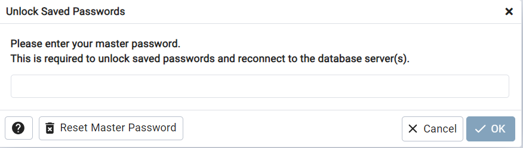
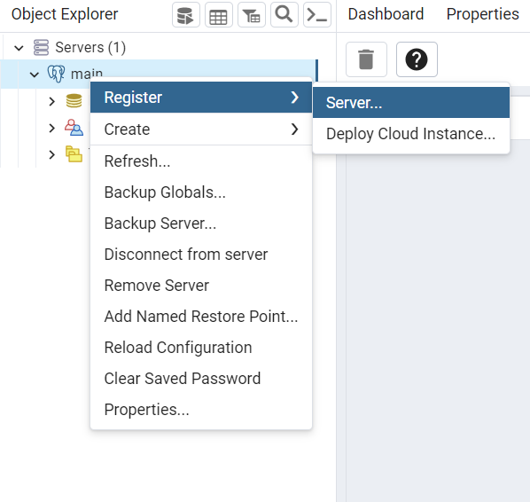
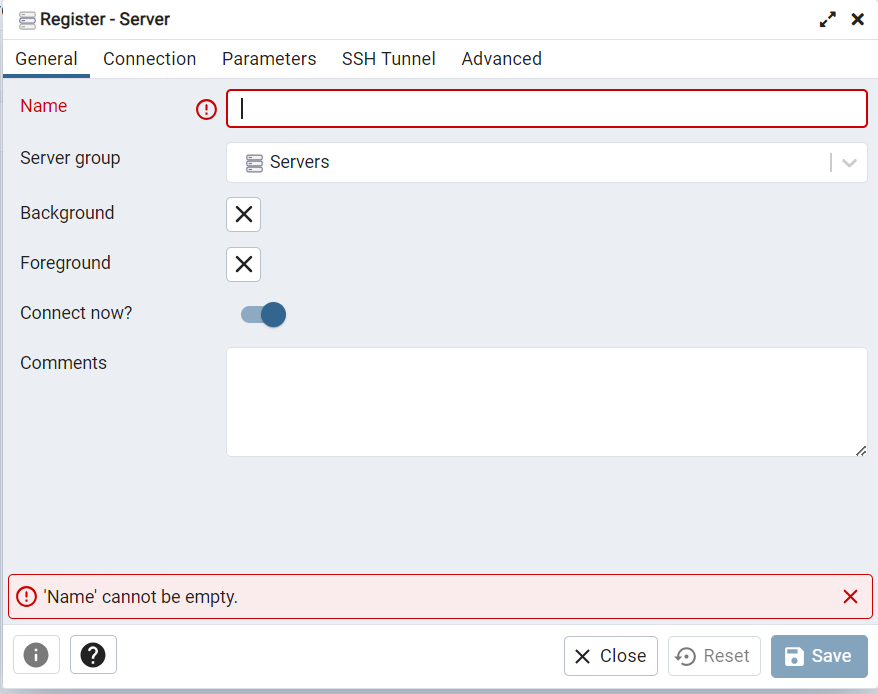
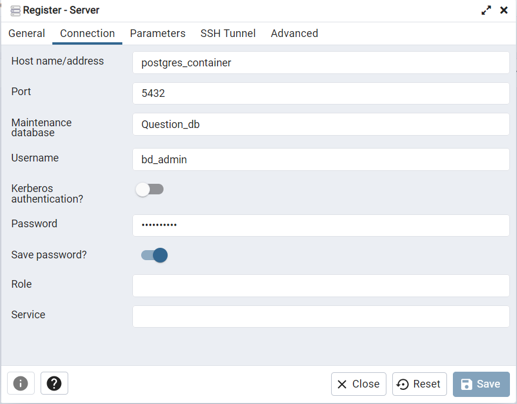
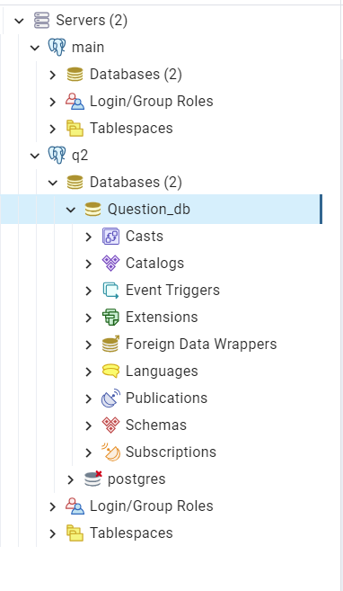

Сервис для генерации вопросов - Qgen
-----------------------------
-----------------------------

***Содержание***
- [Введение](#Intro)
- [Сборка докер образа](#Build)
- [Подключение к сервису и проверка работоспособности](#Preparing-service)
- [подключение pgadmin4 к базе данных](#conn-pg)

# Введение <a id="Intro"></a>
-----------------------------
-----------------------------

**Qgen** — это пример простого проекта c базовой функциональностью. Документация содержит в себе примеры и рекомендации для самостоятельной организации сборки любого нового проекта.
Сам проект —  сервис, который использует API для получения вопросов и занесения их в базу данных.

Подготовка любого нового проекта состоит из шагов, представленных на схеме ниже:

# Сборка докер образа <a id="Build"></a>
-----------------------------
-----------------------------

```bash
docker compose build
docker compose up
```
Ожидаем подгрузки всех зависимостей и запуска сервиса
# Подключение к сервису и проверка работоспособности <a id="Preparing-service"></a>
-----------------------------
-----------------------------
Сервис будет запущен на http://127.0.0.1:8000. На нем присутствует только один рабочий API endpoint
http://127.0.0.1:8000/questions/. На него необходимо отправить POST запрос с json вида: {"questions_num": integer}.
Если post запрос отправлен корректно, то в результате вернется ответ вида: {"message":"Saved n questions"}, где n - количество сохраненных вопросов в БД Postgres.

***Способ быстрой проверки:***

запустите скрипт test.py и проверьте возврщаемый ответ в консоли по критериям выше

# Подключение pgAdmin4 к базе данных <a id="conn-pg"></a>
-----------------------------
-----------------------------

При помощи pgAdmin4 можно в реальном времени просматривать данные в БД.
Этот функционал является моим дополнением к базовому заданию. Для подключения данного сервиса к БД следуйте всем шагам ниже

1. Перейдите по пути http://127.0.0.1:5050/browser/
2.  Введите любой пароль мастера
3. После ввода пароля мастера введи пароль от базы данных: secret_key
4.  Зарегистрируйте сервер
5.  Выбирите любое имя сервера
6.  Введите остальные данные как на рисунке и нажмите "Save"
7.  Теперь вы можете проверить содержание базы данных Question_db сервиса самостоятельно. 

